# M6 - Evaluación de Portafolio  
## Sistema de Capacitaciones (Spring Boot + MySQL)

## 1. Datos del estudiante y docentes

- **Estudiante:** José Correa Herrera  
- **Bootcamp:** Desarrollo Full Stack Java  
- **Módulo:** M6 - Desarrollo de Aplicaciones JEE con Spring framework
- **Docente(s):** Hector Sanchez Trujillo, Cristian Jonhson 


---

## 2. Contexto y objetivo del proyecto

La empresa necesita un **sistema interno de gestión de capacitaciones** para su personal. El objetivo es contar con una sistema web que permita:

- Registrar y administrar cursos de capacitación.  
- Gestionar instructores y empleados inscritos.  
- Permitir autenticación y autorización con roles: **ADMIN** y **EMPLEADO**.  
- Exponer **servicios REST** para que otros sistemas internos consulten cursos y registren inscripciones.  
- Gestionar el ciclo de vida del proyecto utilizando un **gestor de tareas** (GitHub Projects).

Este proyecto se desarrolla con **Spring Boot + MySQL**, aplicando conceptos de:

- Arquitectura por capas (controladores, servicios, repositorios, entidades).  
- Persistencia con Spring Data JPA.  
- Seguridad con Spring Security.  
- Vistas con Thymeleaf.  
- Exposición de endpoints REST y pruebas con Postman.  

---

## 3. Tecnologías utilizadas

- **Lenguaje:** Java (JDK 21/24).  
- **Framework back-end:** Spring Boot 3.3.x  
  - spring-boot-starter-web  
  - spring-boot-starter-thymeleaf  
  - spring-boot-starter-data-jpa  
  - spring-boot-starter-security  
- **Base de datos:** MySQL 8.x  
- **ORM:** Hibernate (vía Spring Data JPA)  
- **Gestor de dependencias:** Maven  
- **Motor de vistas:** Thymeleaf  
- **Control de versiones:** Git + GitHub  
- **Gestor de proyecto:** GitHub Projects (tablero Kanban)  
- **Cliente REST:** Postman  

---

## 4. Arquitectura y estructura del proyecto

### 4.1. Paquetes Java (código)

```text
src/main/java/com/skillnest/m6/capacitaciones
├── M6CapacitacionesApplication.java        # Clase principal Spring Boot
│
├── controller
│   ├── HomeController.java                 # Redirección inicial tras login
│   ├── LoginController.java                # Maneja la vista de login personalizada
│   ├── AdminCursoController.java           # Vistas y acciones para ADMIN (/admin/cursos)
│   ├── EmpleadoCursoController.java        # Vistas para EMPLEADO (/empleado/cursos)
│   │
│   └── api                                # Subpaquete para la API REST
│       ├── CursoDto.java                   # DTO para exponer cursos por REST
│       ├── InscripcionRequest.java         # DTO para recibir inscripciones por REST
│       ├── CursoRestController.java        # GET /api/cursos
│       └── InscripcionRestController.java  # POST /api/inscripciones
│
├── model
│   ├── Curso.java                          # Entidad Curso
│   ├── Empleado.java                       # Entidad Empleado (incluye rol)
│   ├── Inscripcion.java                    # Entidad Inscripcion (Empleado–Curso)
│   └── Instructor.java                     # Entidad Instructor
│
├── repository
│   ├── CursoRepository.java                # JpaRepository<Curso, Long>
│   ├── EmpleadoRepository.java             # JpaRepository<Empleado, Long>
│   ├── InscripcionRepository.java          # JpaRepository<Inscripcion, Long>
│   └── InstructorRepository.java           # JpaRepository<Instructor, Long>
│
└── security
    └── SecurityConfig.java                 # Configuración de Spring Security (rutas, login, roles)
    
```    
    
### 4.2. Recursos (plantillas, estáticos y configuración)

```text  
    
src/main/resources
├── application.properties                  # Configuración de MySQL, JPA y Spring Boot
├── data.sql                                # Datos iniciales (instructor, admin, empleado demo)
│
├── static
│   └── css
│       └── styles.css                      # Estilos generales (login, home, tablas, botones)
│
└── templates
    ├── index.html                          # Home después del login (muestra menú según rol)
    ├── login.html                          # Vista de login personalizada
    │
    ├── admin
    │   └── cursos
    │       ├── lista.html                  # Lista de cursos para ADMIN
    │       └── form.html                   # Formulario de creación/edición de curso
    │
    └── empleado
        └── cursos
            └── lista.html                  # Lista de cursos para EMPLEADO con botón "Inscribirse"
    
```

### 4.3. Documentación, diagramas y evidencias

```text  
docs
├── capturas
│   ├── 01_consola_spring_boot_ok.png
│   ├── 02_login_spring_security.png
│   ├── 03_home_index_admin.png
│   ├── 04_admin_lista_cursos.png
│   ├── 05_admin_form_nuevo_curso.png
│   ├── 06_admin_curso_creado.png
│   ├── 07_empleado_lista_cursos.png
│   ├── 08_empleado_inscripcion_exitosa.png
│   ├── 09_mysql_tablas_principales.png
│   ├── 10_mysql_instructores.png
│   ├── 11_mysql_cursos.png
│   ├── 12_mysql_empleados.png
│   ├── 13_mysql_inscripciones.png
│   ├── 14_postman_get_cursos.png
│   ├── 15_postman_post_inscripciones.png
│   ├── 16_github_projects_inicial.png
│   ├── 17_github_projects_en_progreso.png
│   └── 18_github_projects_final.png
│
├── db
│   └── schema_capacitaciones.sql           # Referencia del esquema relacional MySQL
│
└── diagramas
    ├── diagrama_clases_capacitaciones.puml
    ├── 19_diagrama_clases_capacitaciones.png
    ├── diagrama_flujo_navegacion_capacitaciones.puml
    └── 20_diagrama_flujo_navegacion_capacitaciones.png
```

### 4.2. Entidades y modelo de dominio

Entidades principales:

- **Instructor**
  - id, nombre, email, especialidad.
  - Relación: un Instructor imparte muchos Cursos.

- **Curso**
  - id, nombre, descripción, fechas, cupo máximo, activo.
  - Relación: un Curso tiene muchas Inscripciones.

- **Empleado**
  - id, nombre, email, password, rol (enum Rol: ADMIN / EMPLEADO).
  - Relación: un Empleado puede tener muchas Inscripciones.

- **Inscripcion**
  - id, fechaInscripcion, referencias a Curso y Empleado.
  - Representa la inscripción de un empleado a un curso.

El diagrama de clases se encuentra en:

- `docs/diagramas/19_diagrama_clases_capacitaciones.png`

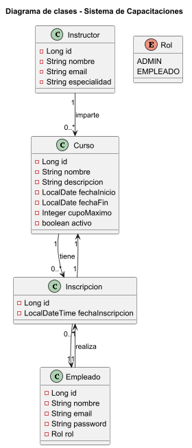
### 4.3. Seguridad y roles

- Se utiliza **Spring Security** con:
  - Autenticación basada en usuarios almacenados en la tabla `empleados`.
  - Carga de usuarios a través de `CustomUserDetailsService`.
- Roles:
  - `ADMIN`: acceso a `/admin/**` (gestión de cursos).
  - `EMPLEADO`: acceso a `/empleado/**` (listar e inscribirse en cursos).
- Rutas protegidas:
  - `/admin/**` → solo usuarios con rol `ADMIN`.
  - `/empleado/**` → usuarios autenticados con rol `EMPLEADO`.
  - `/api/**` → protegidas con Basic Auth (según configuración).

Pantallas principales:

- Login (`/login`)
- Home ADMIN (lista de cursos y acciones CRUD).
- Home EMPLEADO (lista de cursos disponibles e inscripciones).

El flujo de navegación se representa en:

- `docs/diagramas/20_diagrama_flujo_navegacion_capacitaciones.png`

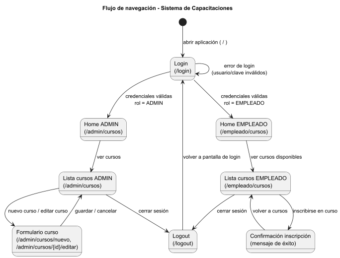

---

## 5. Configuración previa

### 5.1. Requisitos

- JDK instalado (verificado con `java -version`).
- MySQL Server en ejecución en `localhost:3306`.
- IDE de su preferencia  (IntelliJ IDEA recomendado).
- Maven configurado (incluido en IntelliJ).

### 5.2. Creación de la base de datos MySQL

Ejecutar en MySQL Workbench o consola:

```sql
CREATE DATABASE m6_capacitaciones
  DEFAULT CHARACTER SET utf8mb4
  COLLATE utf8mb4_unicode_ci;

CREATE USER 'capacitaciones_user'@'localhost'
  IDENTIFIED BY 'Capacitaciones123';

GRANT ALL PRIVILEGES
  ON m6_capacitaciones.*
  TO 'capacitaciones_user'@'localhost';

FLUSH PRIVILEGES;
```

> Nota: el archivo `docs/db/schema_capacitaciones.sql` se utiliza como **referencia** del modelo relacional generado por JPA (no es obligatorio ejecutarlo, ya que el esquema se genera con `ddl-auto=update`).

### 5.3. Configuración de `application.properties`

Ubicación: `src/main/resources/application.properties`

```properties
spring.datasource.url=jdbc:mysql://localhost:3306/m6_capacitaciones?useSSL=false&serverTimezone=America/Santiago
spring.datasource.username=capacitaciones_user
spring.datasource.password=Capacitaciones123
spring.datasource.driver-class-name=com.mysql.cj.jdbc.Driver

spring.jpa.hibernate.ddl-auto=update
spring.jpa.show-sql=true
spring.jpa.properties.hibernate.format_sql=true
spring.jpa.properties.hibernate.dialect=org.hibernate.dialect.MySQLDialect
```

---

## 6. Ejecución del proyecto

1. Clonar o descargar el proyecto desde GitHub.
2. Abrir la carpeta del proyecto en IntelliJ IDEA U otro IDE de su preferencia.
3. Esperar a que Maven descargue todas las dependencias.
4. Verificar que MySQL está iniciado y que la BD `m6_capacitaciones` existe.
5. Ejecutar la clase:

   - `com.skillnest.m6.capacitaciones.M6CapacitacionesApplication`

6. En la consola de IntelliJ, comprobar que Spring Boot levanta sin errores y que Tomcat queda escuchando en `http://localhost:8080`.

**Captura:**

- `docs/capturas/01_consola_spring_boot_ok.png`  
  (Consola que muestra el arranque exitoso de Spring Boot y el puerto 8080).


---

## 7. Uso de la aplicación (vistas web)

### 7.1. Login y home inicial

1. Abrir el navegador en:  
   `http://localhost:8080/`
2. Aparece la pantalla de login de Spring Security personalizada.
3. Usuarios de ejemplo:

   - ADMIN  
     - Usuario: `admin@empresa.com`  
     - Password: `admin123`
   - EMPLEADO  
     - Usuario: `empleado@empresa.com`  
     - Password: `empleado123`

4. Iniciar sesión primero como **ADMIN** para gestionar cursos.

**Capturas:**

- `docs/capturas/02_login_spring_security.png`  
  (Pantalla de login personalizada).
- 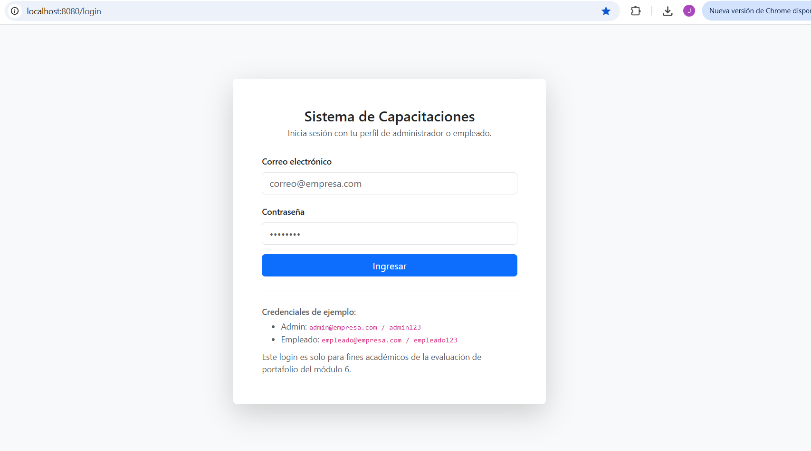

- `docs/capturas/03_home_index_admin.png`  
  (Home/Index mostrando navegación para el rol ADMIN).
- 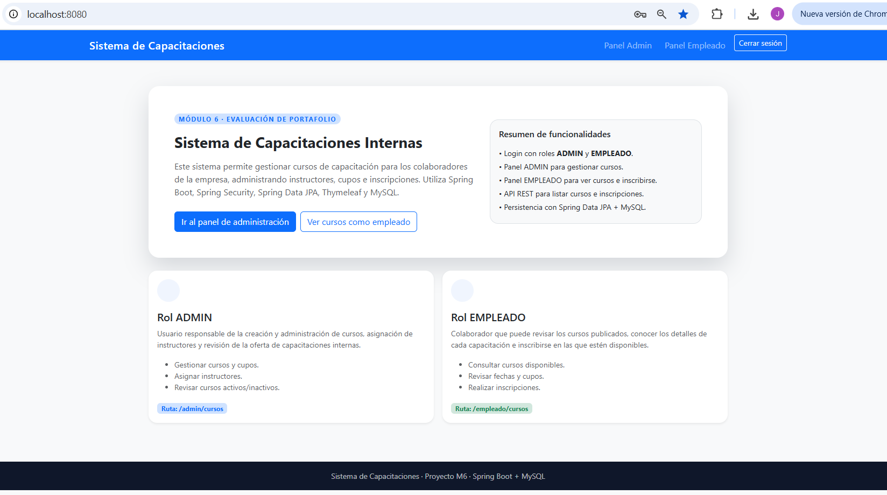

---

### 7.2. Panel ADMIN – Gestión de cursos

Ruta principal:  
`http://localhost:8080/admin/cursos`

Funcionalidades:

- Listar cursos existentes.  
- Crear un nuevo curso.  
- Editar cursos.

Evidencias:

1. Iniciar sesión como `admin@empresa.com`.
2. Ir a **“Gestión de cursos”** o directamente a `/admin/cursos`.
3. Ver la lista actual de cursos.

   - Captura: `docs/capturas/04_admin_lista_cursos.png`
   - 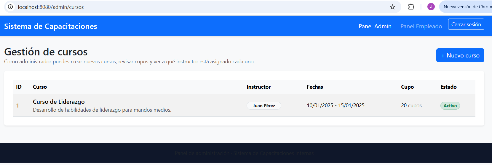

4. Hacer clic en **“Nuevo curso”**:

   - Captura: `docs/capturas/05_admin_form_nuevo_curso.png`
   - 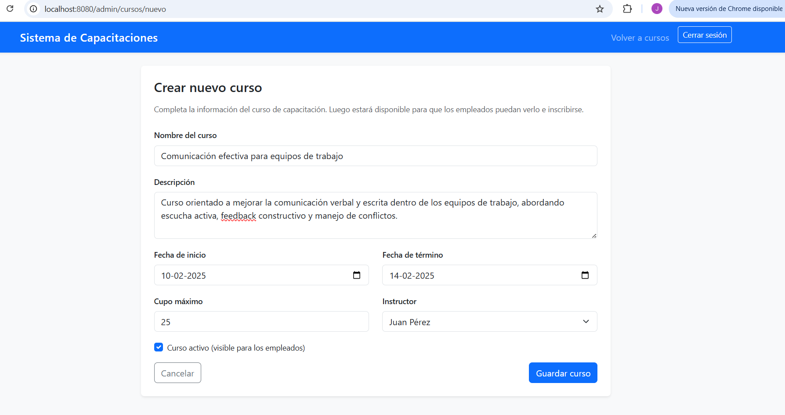

   Datos Registrados:

   - Nombre: `Comunicación efectiva en equipos`  
   - Descripción: `Curso orientado a mejorar la comunicación interna y el trabajo colaborativo.`  
   - Fecha inicio: `2025-02-01`  
   - Fecha fin: `2025-02-05`  
   - Cupo máximo: `25`  
   - Activo: `Sí`  
   - Instructor: `Juan Pérez`  

5. Guardar el curso y volver a la lista, donde debe aparecer el nuevo registro:

   - Captura: `docs/capturas/06_admin_curso_creado.png`
   - 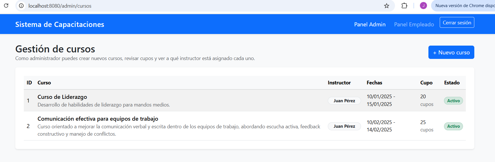
   
    
---

### 7.3. Panel EMPLEADO – Listado e inscripción en cursos

Ruta principal:  
`http://localhost:8080/empleado/cursos`

Pasos:

1. Cerrar sesión como ADMIN (logout).
2. Volver a `http://localhost:8080/` e iniciar sesión como:

   - Usuario: `empleado@empresa.com`  
   - Password: `empleado123`

3. Ser redirigido al panel de empleado y ver el listado de cursos activos.

   - Captura: `docs/capturas/07_empleado_lista_cursos.png`
   - 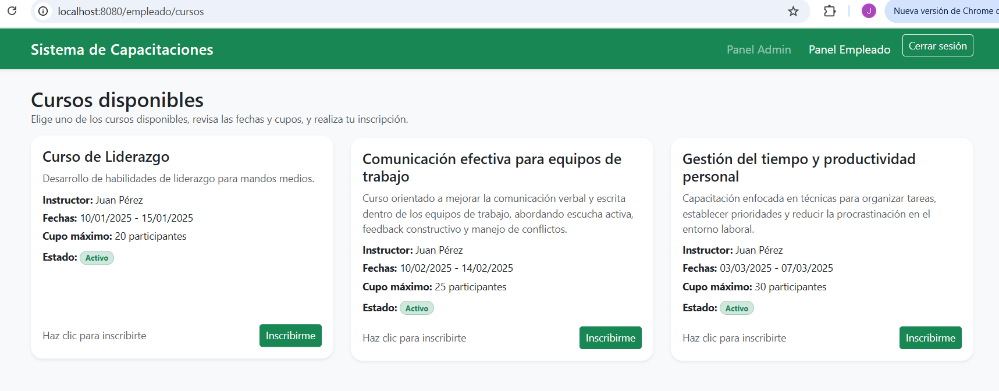

4. Hacer clic en **“Inscribirse”** en uno de los cursos.
5. Confirmar el mensaje de inscripción exitosa (por ejemplo, mensaje en la misma vista o pantalla de confirmación).

   - Captura: `docs/capturas/08_empleado_inscripcion_exitosa.png`
   - 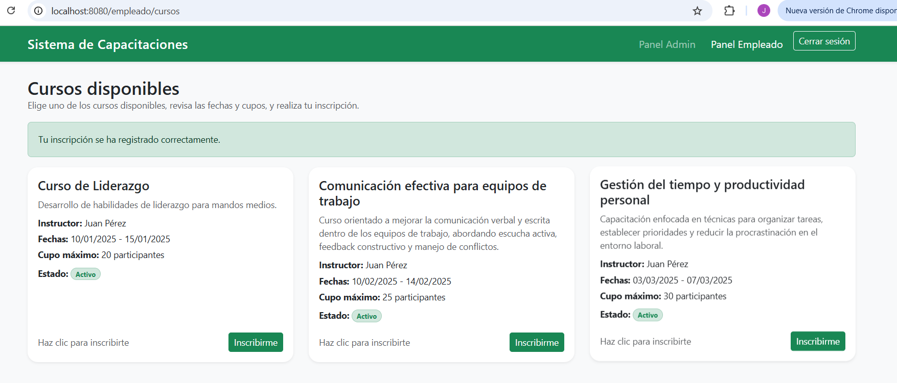

---

## 8. Base de datos y evidencias en MySQL

Una vez realizadas inscripciones, se puede verificar la información directamente en MySQL.

1. Abrir MySQL Workbench.
2. Seleccionar la BD `m6_capacitaciones`.
3. Ejecutar:

```sql
SHOW TABLES;
SELECT * FROM instructores;
SELECT * FROM cursos;
SELECT * FROM empleados;
SELECT * FROM inscripciones;
```

**Capturas:**

- `docs/capturas/09_mysql_tablas_principales.png`
  (Resultado de `SHOW TABLES` mostrando las tablas principales).
- 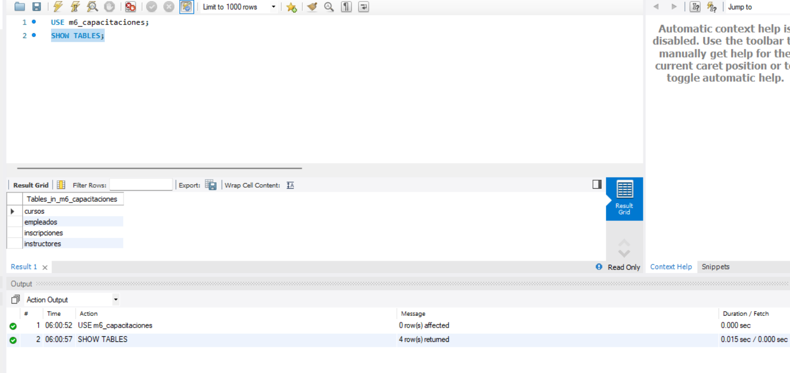
 

- `docs/capturas/10_mysql_instructores.png`  
  (Resultado de `SELECT * FROM instructores;`).
- 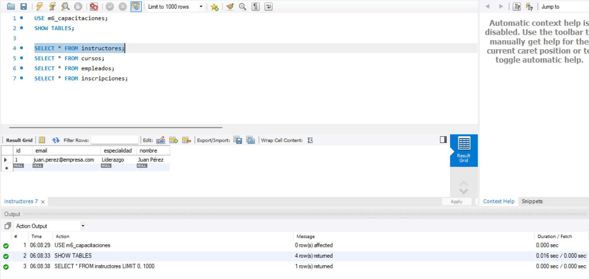


- `docs/capturas/11_mysql_cursos.png`  
  (Resultado de `SELECT * FROM cursos;`).
- 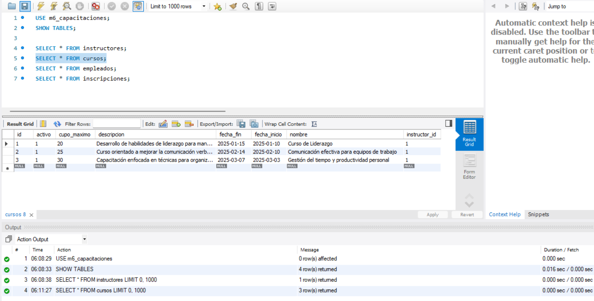


- `docs/capturas/12_mysql_empleados.png`  
  (Resultado de `SELECT * FROM empleados;`).
- 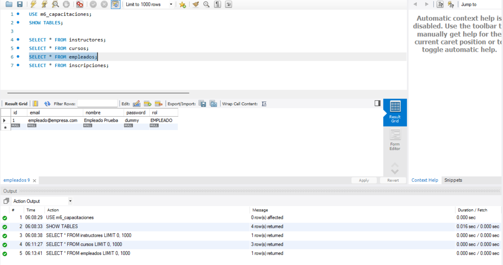


- `docs/capturas/13_mysql_inscripciones.png`
  (Resultado de `SELECT * FROM inscripciones;` con las inscripciones realizadas).
- 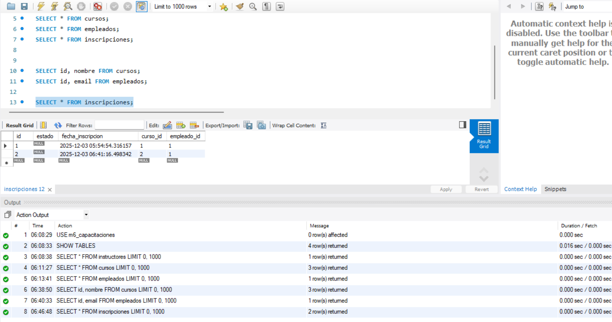


---

## 9. Servicios REST y pruebas con Postman + Captura de Evidencias

### 9.1. GET /api/cursos – Listado de cursos

- **Método:** GET  
- **URL:** `http://localhost:8080/api/cursos`  
- **Autenticación:** Basic Auth (por ejemplo, usuario EMPLEADO).

Pasos:

1. Abrir Postman.
2. Crear una nueva petición GET a:

   `http://localhost:8080/api/cursos`

3. En la pestaña **Authorization**:
   - Type: `Basic Auth`
   - Username: `empleado@empresa.com`
   - Password: `empleado123`
4. Enviar la petición.
5. Verificar que la respuesta es un JSON con la lista de cursos.

**Captura:**

- `docs/capturas/14_postman_get_cursos.png`
- 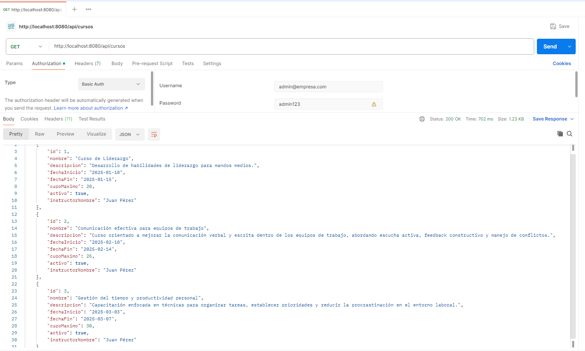

---

### 9.2. POST /api/inscripciones – Registrar inscripción

- **Método:** POST  
- **URL:** `http://localhost:8080/api/inscripciones`  
- **Autenticación:** Basic Auth (empleado).  
- **Body (JSON):**

```json
{
  "empleadoEmail": "empleado@empresa.com",
  "cursoId": 1
}
```

Pasos:

1. En Postman, crear una petición POST a:

   `http://localhost:8080/api/inscripciones`

2. En **Authorization**:
   - Type: `Basic Auth`
   - Username: `empleado@empresa.com`
   - Password: `empleado123`

3. En la pestaña **Body**:
   - Seleccionar `raw` + `JSON`.
   - Pegar el JSON de ejemplo (ajustar `cursoId` a un id existente).

4. Enviar la petición.
5. Verificar:
   - Respuesta exitosa (mensaje/JSON de confirmación).
   - Se agrega un registro en la tabla `inscripciones`.

**Captura:**

- `docs/capturas/15_postman_post_inscripciones.png`
- 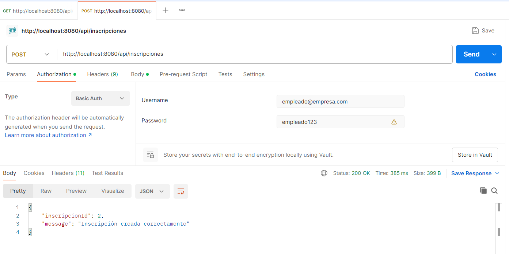

---

## 10. Gestión del ciclo de vida del proyecto (GitHub Projects)

Para gestionar el ciclo de vida del proyecto se utilizó **GitHub Projects** con un tablero tipo Kanban asociado al repositorio.

### 10.1. Estructura del tablero

Columnas:

- **Backlog**: ideas y tareas aún no priorizadas.  
- **To Do**: tareas planificadas para el siguiente ciclo.  
- **In Progress**: tareas en desarrollo activo.  
- **Done**: tareas completadas.

Campo personalizado:

- **Etapa** (Single select), con valores:
  - `Planificación`
  - `Configuración y BD`
  - `Modelo y repositorios`
  - `Vistas y controladores`
  - `Seguridad`
  - `Servicios REST`
  - `Pruebas y documentación`
  - `Mejoras Futuras`

### 10.2. Tareas representativas

Se definieron tareas agrupadas, por ejemplo:

- `Definir alcance y requerimientos del sistema de capacitaciones` (Planificación)  
- `Configurar conexión a MySQL, crear BD m6_capacitaciones, usuario y probar ddl-auto=update` (Configuración y BD)  
- `Implementar entidades JPA (Instructor, Curso, Empleado, Inscripcion) con sus relaciones` (Modelo y repositorios)  
- `Implementar controlador y vistas de ADMIN para gestionar cursos (/admin/cursos)` (Vistas y controladores)  
- `Configurar usuarios y roles (ADMIN, EMPLEADO) y reglas de acceso a /admin/** y /empleado/**` (Seguridad)  
- `Implementar endpoint REST GET /api/cursos y POST /api/inscripciones` (Servicios REST)  
- `Capturar evidencias (vistas web, base de datos, Postman, tablero GitHub Projects)` (Pruebas y documentación)  
- `Completar README.md con pasos de ejecución, descripción de arquitectura y reflexión final` (Pruebas y documentación)  

### 10.3. Evidencias del tablero

Se tomaron capturas del tablero en tres momentos clave:

1. **Estado inicial – Planificación**  

   - Mayoría de tareas en **Backlog**.  
   - Algunas en **To Do** (alcance, modelo de datos, creación del proyecto).  
   - 1 tarea en **In Progress** (configuración del repo/tablero).  
   - **Done** vacío.

   
   
   

2. **Estado intermedio – Desarrollo en marcha**  

   - Tareas de Planificación, Configuración y parte del Modelo ya en **Done**.  
   - Vistas y controladores / Seguridad en **In Progress**.  
   - Servicios REST + Pruebas en **To Do**.

   
   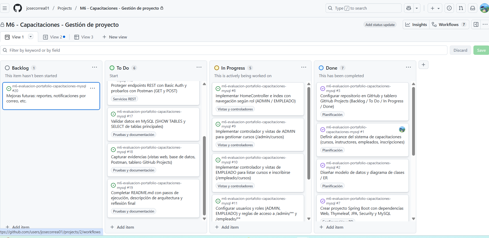
   

3. **Estado final – Cierre del proyecto**  

   - La mayoría de las tareas en **Done**.  
   - Solo queda documentación/reflexión en **In Progress** o **To Do**.  

   
   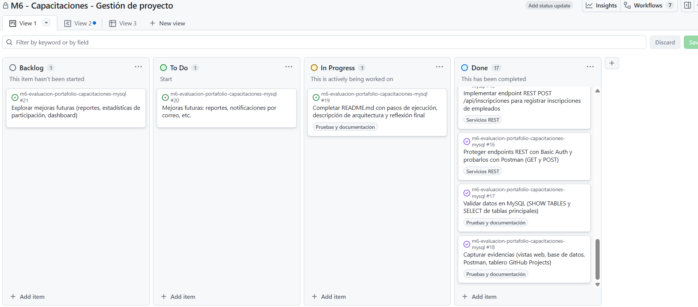
   

---

## 11. Diagramas

### 11.1. Diagrama de clases

Archivo:

- PlantUML: `docs/diagramas/diagrama_clases_capacitaciones.puml`  
- Imagen: `docs/diagramas/19_diagrama_clases_capacitaciones.png`


### 11.2. Diagrama de flujo de navegación

Archivo:

- PlantUML: `docs/diagramas/diagrama_flujo_navegacion_capacitaciones.puml`  
- Imagen: `docs/diagramas/20_diagrama_flujo_navegacion_capacitaciones.png`


---

## 12. Reflexión final y posibles mejoras

Durante el desarrollo de este proyecto se integraron de forma práctica varios conceptos clave del módulo:

- Configuración de un proyecto **Spring Boot** con múltiples starters (Web, Thymeleaf, JPA, Security).  
- Modelado de un dominio realista (capacitaciones) con entidades y relaciones en **JPA** sobre **MySQL**.  
- Implementación de **vistas MVC** con Thymeleaf para diferentes roles de usuario (ADMIN / EMPLEADO).  
- Configuración de **Spring Security** para proteger rutas según rol y uso de Basic Auth en la API REST.  
- Exposición de endpoints REST y pruebas con **Postman**, validando la interoperabilidad con otros sistemas.  
- Uso de **GitHub Projects** para planificar, visualizar y evidenciar el progreso del proyecto a lo largo de su ciclo de vida.

**Dificultades principales:**

- Ajustar la configuración de la base de datos (usuarios, permisos y propiedades de conexión).  
- Comprender el flujo completo de autenticación/autorización y la protección de rutas por rol.  
- Coordinar las vistas, los controladores y el modelo de datos de forma coherente.  

**Posibles mejoras futuras:**

- Agregar un módulo de **reportes** (ej. cantidad de inscritos por curso, asistencias, etc.).  
- Notificar por correo electrónico a los empleados inscritos cuando se los agrega a un curso.  
- Incorporar **paginación y filtros** en las listas de cursos.  
- Implementar autenticación basada en **JWT** para la API REST.  
- Integrar un sistema de evaluación de cursos (feedback de empleados, puntuaciones).

Este proyecto representa un hito dentro del módulo M6, consolidando conocimientos de backend, seguridad, vistas y APIs REST sobre un caso de uso cercano a un entorno profesional real.
